    n# Trabajo Individual

Ronal Jancoña Paicho 

GitHub: RonalSinD

## Clase 1 

### ¿Qué es GIT?
Es un Sistema de Control de  Versiones Distribuido (VCS) open source, creado poor Linus Torvalds en 2005.
nos permite guardar archivos y las versiones de estos a lo largo del tiempo de manera local, guarda el historial de cambios de un proyecto, podemos volver atras si algo falla, trabajo en equipo sin perjudicar a ningun integrante ya que cada uno tiene una copia completa del repositorio, mantener diferentes verciones de un mismo proyecto `ramas`.


### ¿Cómo nació GIT?
La creacion de GIT sucedio por varias razones de un mismo problema, porque en ese entonces BITKEEPER dejo de ser gratuito y Linus Torvalds no queria pagar por una licencia por que linux es open source, asi que decidio crear su propio sistema de control de versiones al que llamo GIT, motivado tambien por que estaba cansado de depender de heramientas propietarias que no podia controlar, termino creando una de las herramientas mas importantes para los desarrolladores en todo el mundo.

Creo GIT en 2 a 3 semanas despues...


### ¿Cómo instalar GIT?
Para instalar GIT debe de ir a su pagina web [Instalar GitHub](https://git-scm.com/downloads) y seguir los pasos de instalacion de tu Sistema Operativo, Git esta disponible tanto para:

Linux:    [descarga](https://git-scm.com/install/linux)


macOS:    [descarga](https://git-scm.com/install/mac)


Windows:  [descarga](https://git-scm.com/install/windows).


GIT es multiplataforma, funciona de igual madera en deferentes Sistemas Operativos, lo unoco que cambia es la forma de instalarlo: como tengo Debian lo explicare, en la distro de Debian se deben de ejecutar los comandos:```sudo apt update``` y ```sudo apt install git``` asi de facil, una vez instalado GIT verifica con el comando ```git --version```


### Configuraciones Básicas
Antes de comenzar a usar Git, es recomendable configurar tu nombre de usuario y correo electrónico:
```bash
git config --global user.name "Tu Nombre"
git config --global user.email "tu_correo@gmail.com"
git config --global core.autocrlf true
```
este ultimo es importante porque sirve para manejar automaticamente los saltos de  linea entre distintos Sistemas Operativos, resuelve el problema de:

Windows usa: CRLF(Carriage Return + Line Feed)

Linux/macOS usan: LF (Line Feed)


### Archivos que todo repositorio debería tener
README.md es un archivo  de documentacion en formato Markdown(.md) esto describe tu proyecto, sirve para expllicar que hace tu proyecto, indica como instalarlo o usarlo, muestra ejemplos, documentar dependencias, comandos, estructura, da un contexto a cualquier persona que vea el repositorio.


#### README.md
Es importante porque es lo primero que se ve en la plataforma de GITHUB, permite que otros entiendad tu proyecto sin leer codigo, mejora la presentacion y profecionalismo del repositorio.


#### .gitignore
.gitignore es un archivo que le dice a Git qué archivos o carpetas NO debe rastrear (trackear), sirve para evitar subir cosas innecesarias o sencibles como archivos temporales(`.log`,`.tmp`), dependencias(`node_modules/`), archivos del sistema(.`DS_Store`,`Thumbs.db`), configuraciones locales, claves o contraseñas.


tanto README.md y .gitignore se usan siempre juntos, porque cumple funciones complementarias 

README.md `Explica el proyecto`

.gitignore `Mantener limpio el repositorio`


## Clase 2

### STATES Y COMMITS
Un resumen breve de estos dos conceptos seria que states(estados en Git), son las etapas por las que pasa un archivo de un Git, `Directorio de Trabajo`: La carpeta local, donde estamos trabajando, pero Git aun no lo tiene registrado, `Stage Area`: El area de espera donde todo esta lsito para guardarse, `Repositorio local`: archivo guardado en el historial del repositorio.

Commit(buenas practicas) seria un modo convencional para escribir mensajes de commit claros, estructurados y consistentes, de modo que el historial del proyecto sea facil de entender y automatizar.


```Bash
Directorio de Trabajo: 
  ⮟
  Creo,modifico o elimino los ficheros
  ⮟
  Preparo los cambios que quiero grabar
  ⮟
Area Temporal Transitoria(Stage Area)
  ⮟
  Confirmo los cambios y los grabo en el repositorio
  ⮟
Repositorio Local
  ⮟
  Sincronizo los cambios con el repositorio en el servidor
  ⮟
Repositorio Remoto
```
### DIRECTORIO DE TRABAJO (MODIFICADO)
Es smplemente una carpeta comun, con la unica diferencia que Git observa tus archivos, y los cataloga en:

`Untracked`: Archivo nuevo de Git o esta en seguimiento

`Modified`: Archivo que ya existe en Git, pero fue modificado

cuando un archivo no esta en el `.gitignore` pasa automaticamente a uno de estos estados

#### git restore archivo
Borra fisicamente lo que escribieron haciendo que tu archivo vuelva asu estado de ultimo commit, asi que mucho cuidado con este comando.

#### touch .gitignore
Crea una carpeta destinada para archivos, cuando tienes este archivo no se sube al repositorio, no existira para otros, no se vera todo lo que este en el .gitigore, no se vera nada de lo que contenga en el gitignore en platafirmas como GIT HUB.

### STAGE AREA (PREPARADO)
Nos permite seleccionar archivos modificados que es incluiran en el siguiente commit(guardado) y cuales no.
para traer archivos a este estado se debe hacer 
 
 ```Bash
 git add archivo : "agrega el archivo name_archivo, lo hace uno por uno"
 git add . : "agrega todos los archivos que esten obserbados por Git"
 git restore --staged archivo : "para sacar un archivo estado stage area para 
 ```

### REPOSITORIO LOCAL (CONFIRMADO)
Es la ultima fase donde le decimos al repositorio que cree el punto de guardado para que todos los cambios que estan en staged pasen a ser parte del historial.
```bash
 git commit -m "mensaje"
 git reset --soft HEAD~1 : si quieres deshacer el ultimmo commit
```


### BUENAS PRACTICAS
#### ¿Cada cuanto debo hacer un commit?
Los commits atómicos son una práctica en Git donde cada commit representa un único cambio pequeño, unico y completo. Es lo contrario a hacer un solo commit grande con muchos cambios, se divide el trabajo en partes pequeñas

Cada commit resuelve una sola cosa, ser entendible por si mismo, mantener el proyecto en estado funcional

### Escribe buenos commits
Un commit debe de describir lo  que hace en pocas palabras y de manera simple pero efectiva:
#### 1. USA VERBOS IMPERATIVOS
```bash
Add: "Significa que se agrega un nuevo archivo"

Change: "Significa que se modifica un archivo existente"

Fix: "Significa que se arregla un bug"

Remove: "Significa que seelimina un archivo existente"
```

#### 2. NO USES PUNTO FINAL NI PUNTOS SUSPENSIVOS EN TUS MENSAJES
Usar puntuación mas alla de una coma es innecesario a la hora de hacer un buen commit
```bash
git commit -m “Add new search feature.”  MAL. No uses punto final

git commit -m “Fix a problem with topbar..” MAL. No uses puntos suspensivos

git commit -m “Change the default system color” BIEN
```

#### 3. USA COMO MAXIMO 50 CARACTERES
Se corto y conciso con tus commits, evitando explicar mucho en un solo commit, siiendo una buena practica separarlo en diferentes commits 


#### 4. USA PREFIJOS PARA TUS COMMITS PARA HACERLO MAS SEMANTICO 
Para que el historial sea legible y se sepa mas facilmente lo que se hace se usa este tipo de commits:

 ```git commit -m "tipo de commit:descripcion" ```


 ```git commit -m "feat: add search feature" ```
```bash
Prefijos:

feat: "para una nueva característica para el usuario."

fix: "para un bug que afecta al usuario."

perf: "para cambios que mejoran el rendimiento del sitio"

build: "para cambios en el sistema de build, tareas de despliegue o instalación"

ci: "para cambios en la integración continua"

docs: "para cambios en la documentación"

refactor: "para refactorización del código como cambios de nombre de variables o funciones"

style: "para cambios de formato, tabulaciones, espacios o puntos y coma, etc; no afectan al usuario"

test: "para tests o refactorización de uno ya existente."
```


#### 5. AÑADE TODO EL CONTEXTO QUE SEA NECESARIO EN EL CUERPO DEL COMMIT
A veces un commit no se puede explicar bien con una sola frase. En esos casos, en vez de hacer el título muy largo o confuso, se añade información extra en el cuerpo del mensaje del commit.

Con git commit, la primera línea se usa como título corto y claro, y a partir de la segunda línea se escribe la explicación detallada. En esta parte sí se pueden usar reglas normales de escritura, como puntos y comas, porque sirve para dar contexto más completo del cambio.

La idea es mantener el título simple, y usar el cuerpo solo cuando realmente haga falta explicar mejor qué se hizo o por qué se hizo.
```bash
git commit 

prefijo: "Titulo de tu commit "

Cuerpo "Describe tu commit"
``` 

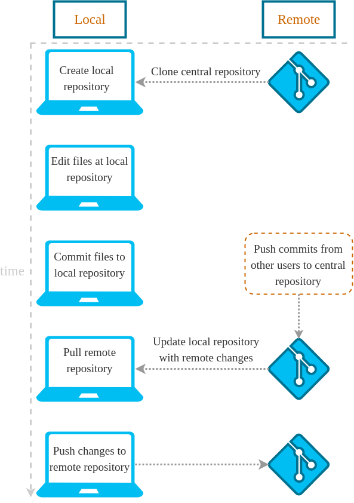 


## Clase 3 
  
### GITHUB Y SSH {<Clase="3"/>}

### ¿Que es GitHub?

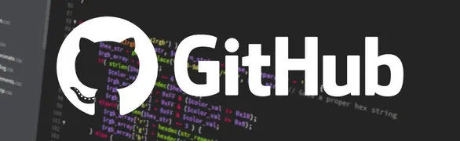

Github es una plataforma en  la nube y red social para desarrolladores que permite alojar, gestionar y colaborar en proyectos de softeare utilizado Git, basiamente  Git es el repositorio locar y Github es el repositorio remoto.

```bash
Git:"herramienta local de contro de versiones(repositorio locar)"
GitHub:"servicio de internet que usa Git para guardar repositorios(repositorio remoto"
```
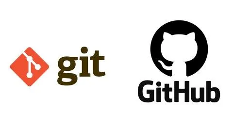)

GitHub sirve para subir proyectos de programacion, colaborar con otras personas, revisar cambios hechos por diferentes usuarios, hacer copias de seguridad del codigo, mostrar proyectos (portafolio). 


### SSH vs HTTPS

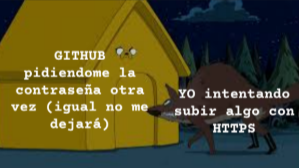

#### HTTPS
Cuando clonamos y queremos usar un repositorio con HTTPS, este nos pedira autenticarnos cada vez, hasta pidiendonos un token. Lo cual hace que sea cansino y molesto.

#### SSH
Configuramos en nuestra PC/Laptop ssh para comunicarnos con github, mediante una key la cual al ponerla en Github no necesitara pedirnos autenticarnos cada vez.

Por tales inconvenientes con HTTPS  es mas recomemndable usar SSH KEY

#### Configuracion SSH 

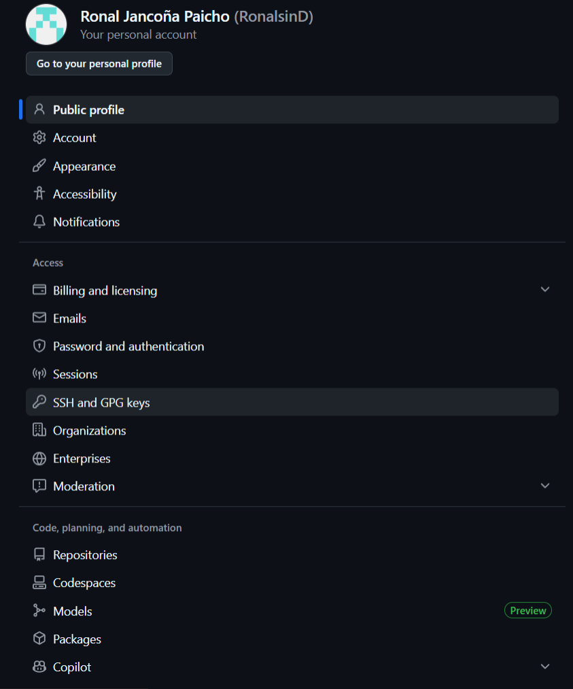

<span style="color:orange">Por terminal ejecutamos los siguientes comandos desde tu terminal si estas en Linux o desde Git Bash si estas en Windows </span>

```bash 
ssh-keygen -t ed25519 -C “tu-correo@email.com”

cat ~/.ssh/id_ed25519.pub

ssh -T git@github.com
```

<span style="color:orange">Copias el contenido del anteroir comando y te diriges a github donde te diriges a tu perfil → Settings y luego SSH y GPG Keys y luego “New SSH Key” (1) y pegas tu key, le das un nombre para tu PC y click en “Add SSH Key</span>


#### Crear un repositorio en GitHub

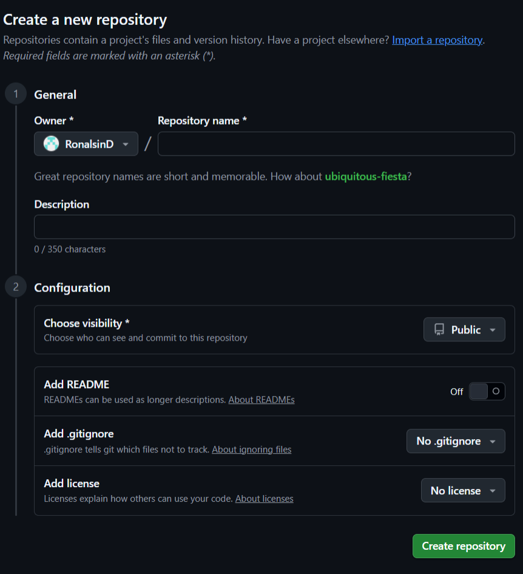

1.Vas a tu apartado de repositoriosen https://github.com/Tu-user? tab=repositories y Click en “New”

2.Pones el nombre de tu repositorio, y si quieres una descripción. Y luego click en “Create Repository”

#### Conectar un repositorio local de Git existente con uno en Github

git remote add origin git@github.com:TuUser/TuRepo.git

<span style="color:orange">Remote es la URL que apunta al servidor externo es decir a
tu repositorio externo creado en Github y Origin es
simplemente el apodo(nickname) que git le da por defecto a esa
URL</span>

git brach -M main 

git push -u origin main

```bash
Primero debes de haber inicializado tu repositorio local (git init) y tener un commit inicial al menos 
```

git init

git add .

git commit -m "Initial commit"

#### Clonar un repositorio de Git

<span style="color:orange">Para la clonacion de un repositorio de git (repositorio local) debes:</span>
```bash
git clone “git@github.com:TuUser/TuRepo.git”
```
<span style="color:orange">Si por accidente lo hiciste con HTTPS</span>
```bash
git clone “https://github.com/TuUser/TuRepo.git”
```
<span style="color:orange">Usa este comando para cambiar el puntero de github y no te pida autenticación cada vez:</span>


```bash
git remote set-url origin “git@github.com:TuUser/TuRepo.git”
```
Este comando también se usa si quieres cambiar el
repositorio remoto al cual esta conectado el repositorio

<span style="color:orange">Si quieres ver a que repositorio remoto esta conectado tu repositorio:</span>
```bash
git remote -v
```

#### Cambios
<span style="color:white">Subir cambios </span>

```bash
git push origin <rama>"
```

<span style="color:orange">git push </span>

`"Empujar" mis commits.`

<span style="color:orange">origin </span>

`¿A dónde? Al servidor que apodamos "origin" (GitHub).`

<span style="color:orange"> rama </span>

`¿Qué rama? La rama <rama> de mi código.`

<span style="color:white">bajar los cambios hechos</span>

```bash
git pull origin <rama>
```

<span style="color:orange"> git pull </span>


`"Traer" los commits del servidor.`


<span style="color:orange"> origin </span>


`¿De dónde? Del servidor que apodamos "origin" (GitHub).`


<span style="color:orange"> rama </span>


`¿Qué rama? La rama <rama> de mi código.`


## Clase 4 
### REMOTE, SSH MULTIPLE Y CHECKOUT 

### GIT REMOTE 
git remote es el comando que nos permite gestionar nuestras conexiones con los repositorio remotos, le dice a GIT local donde enviar o de donde traer la información, algunos comandos utiles son:

git remote -v (Nos permite ver las URLs exactas donde
apunta nuestro repositorio)
git remote add <apodo> “url” (Vincula nuestro repo local
con uno en la nube.)
git remote set-url <apodo> “url” (Cambia la url donde
apunta nuestro repositorio)

### MULTIPLES SSH 
Si tenemos mas de una cuenta de Github o necesitamos tener otras cuentas es util tener mas de una llave SSH, pues esta nos da acceso a cada cuenta, es un tunel, pero cada cuenta necesita su tunel para que estos no choquen.

Es como tener una llave para cada puerta, una no abre la otra ¿no?, si una llave abre multiples puertas quiza deberiamos reconsiderar los cerrojos.

### CONFIGURAR MULTIPLES SSH

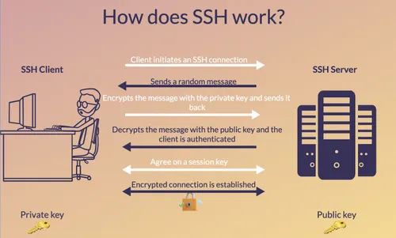

Paso 1. Generamos el sshkey en conotro nombre:

<span style="color:orange"> ssh-keygen -t ed25519 -C </span>

<span style="color:orange"> "micorreo@gmail.com" -f ~/.ssh/id_miname </span>

Paso 2. Creamos un archivo config para que no choquen las key
```bash
# Cuenta Personal (la de siempre)

Host github.com

HostName github.com

User git

IdentityFile ~/.ssh/id_ed25519 
```
```bash
# Cuenta del otro correo
Host github-miname
HostName github.com
User git
IdentityFile ~/.ssh/id_miname
```
```bash
# Host:

Es el apodo o alias que le pones a la conexión. Es lo que escribes en la terminal después de git@.

# HostName:

Es la dirección real del servidor a donde nos conectamos. Siempre será github.com

# User:

Es el nombre de usuario del sistema remoto. Para GitHub, siempre, siempre es git.

# IdentityFile:

Es la ruta exacta hacia la "escalera" (la llave privada) que quieres usar para ese Host específico.
```

Paso 3. Para verificar si funciona ejecutamos el comando:

<span style="color:orange"> ssh -T git@github-miname </span>

### CONFIGURACIONES LOCALES 
Es decir por repositorio

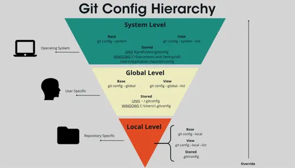

Las configuraciones locales se imponen a las globales, y estas solo funcionan para el repositorio en el que se aplican. Para hacer configuraciones locales lo que se debe hacer es lo mismo que en las globales pero sin el flag --global:

<span style="color:orange">git config user.name "Mi nuevo Name"</spam>

<spam style="color:orange">git config user.email "micorreo@gmail.com"</spam>


<h1 align="center" style="color:#2ecc71;">
“NO TE OLVIDES HACER <br>
GIT CLONE CON EL <br>
HOST CORRECTO <br>
PARA TU CUENTA”
</h1>


<p align="center">
<code>git clone git@github-miname:usuario/repo.git</code>
</p>

### Git Checkout
Es un comando de Git que se utiliza para cambiar el estado del repositorio a otro punto específico del historial. Esto normalmente implica moverse entre ramas, restaurar archivos o revisar versiones anteriores. permite cambiar la referencia actual (HEAD) hacia otra rama, commit o archivo, actualizando el contenido del directorio de trabajo para reflejar ese estado.

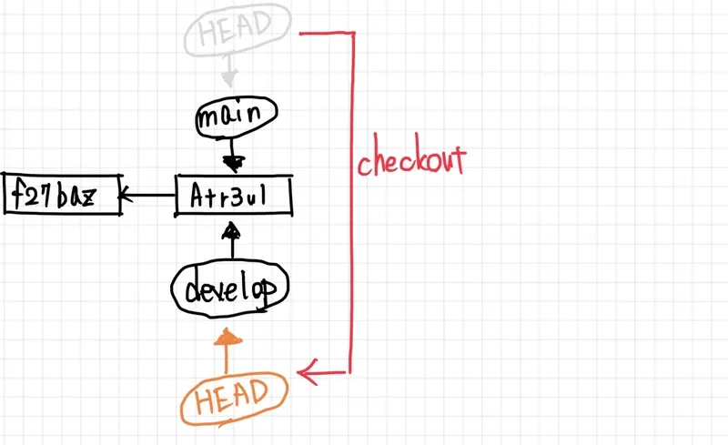

 <span style="color:orange"> 1. cambiar de rama </span>

 ```bash
 git checkut nombre-rama
 ```

  <span style="color:orange"> 2. Crear y cambiar a una nueva rama</span>

```bash
git checkout -b nueva-rama
```
<span style="color:orange"> 3. Volver a un commit especifico </span>

```bash
git checkout <hash>
```

<span style="color:orange"> 4. Restaurar  archivos</span>

```bash
git checkout -- archivo.txt
```

### El Estado "Detached HEAD"
Normalmente, el HEAD apunta a una Rama (que se mueve). En estado desacoplado, el HEAD apunta directamente a un Commit (que es fijo). En condiciones normales, HEAD apunta a una rama (por ejemplo, main), y esa rama apunta al último commit. Esto permite que cualquier nuevo commit avance la rama automáticamente.

quiera decir que eres un esparctador en el pasado, puedes ver todo y escribir notas, pero no tienes cuerpo (rama), s te vas al presente sin "encarnar " en una rama tus cambios se pierden en el vacio.

### ¿Cómo ir y volver de un commit?
Para ir atras debes hacer: git checkout <hash_antiguo> y para volver al ultimo hash de la rama git checkout <rama>, significa moverse temporalmente a un punto específico del historial del proyecto para inspeccionarlo o probarlo. “Volver” implica regresar a la rama actual (como main) o al estado más reciente sin perder el flujo normal de trabajo.

si hiciste algo aca (commiteaste) desaparece salvo que hagas 

<span style="color:orange">git checkout <hash_commit_creado></span>

<span style="color:orange">git checkout -b rama_nueva</span>

<h2><span style="color:white"> Conceptos Clave</span></h2>

<div>
  <h3><span style="color:2EE6C6">HEAD</h3>
  <p>
    Apunta a la <strong>versión actual del proyecto</strong> en la que estás trabajando.
    Generalmente referencia el último commit de la rama actual.
  </p>
</div>

<div>
  <h3><span style="color:2EE6C6">Branch (rama)</span></h3>
  <p>
    Es una <strong>línea de desarrollo independiente</strong>.
    Permite trabajar en nuevas funcionalidades sin afectar la rama principal.
  </p>
</div>

<div>
  <h3><span style="color:2EE6C6">Working Directory</span></h3>
  <p>
    Son los <strong>archivos visibles en tu carpeta de trabajo</strong>.
    Representan el estado actual que puedes modificar.
  </p>
</div>


<h2>Buenas Prácticas del Checkout</h2>

<div>
  <h3> <span style="color:#2EE6C6">No trabajes mucho tiempo en 'detached HEAD'</span></h3>
  <p>Si vas a escribir más de dos líneas, mejor crea una rama.</p>
</div>

<div>
  <h3> <span style="color:#2EE6C6">Limpia tu directorio de trabajo</span></h3>
  <p>Haz commit antes de moverte entre commits.</p>
</div>

<div>
  <h3><span style="color:#2EE6C6"> Úsalo para aprender</span></h3>
  <p>Explorar commits antiguos ayuda a entender proyectos grandes.</p>
</div>

## Clase 5 

### RAMAS Y GITFLOW BÁSICO
La base del traabajo remoto en equipo con GIT.

¿QUÉ SON LAS RAMAS?
Las ramas son una de las principales utilidades que disponemos en GIT para llevar un mejor control del código. Se trata de una bifurcación del estado del código que crea un nuevo camino de cara a la evolución del código, en paralelo a otras ramas que se puedan generar.

Gracias a las ramas, es posible trabajar en nuevas funcionalidades, correcciones o pruebas sin modificar directamente la rama principal del proyecto. Cada rama evoluciona de manera independiente mediante commits propios y, posteriormente, los cambios pueden integrarse nuevamente al proyecto principal.

Las ramas facilitan: 

trabajo en equipo.

la organizacion del desarrolo.

la separacion de funcionalidades.

la reguridad del codigo al evitar la version estable del proyecto.


#### GIT BRANCH


Git branch es un comando de Git que permite gestionar las ramas que tiene o tendrá un proyecto.
Mediante este comando es posible crear, visualizar, renombrar o eliminar ramas, facilitando así la organización y el control del desarrollo del código.

Las ramas permiten trabajar en diferentes funcionalidades o cambios de manera independiente, por lo que git branch se convierte en una herramienta fundamental para administrar esos distintos caminos de desarrollo dentro de un repositorio.

git branch:
```bash
Listar las ramas disponibles: Muestra todas las ramas existentes del proyecto e indica en cuál estamos trabajando actualmente, es decir, la posición actual del HEAD
```
git branch <rama>:
```bash
Permite crear una nueva rama a partir de la rama en la que nos encontramos posicionados actualmente
```
git branch -D <rama>:
```bash
Eliminar ramas: También permite borrar ramas que ya no son necesarias dentro del proyecto.
```
#### GIT CHECKOUT ENFOCADO EN RAMAS

Si bien el comando git checkout puede utilizarse para visualizar versiones anteriores del proyecto mediante commits, también puede trabajar junto con las ramas para realizar distintas acciones.

git checkout <rama>
```bash
Permite movernos de una rama a otra dentro del repositorio.
Para hacerlo correctamente, no debemos tener archivos en estado modified, untracked o staged, ya que podrían generarse conflictos o pérdida de cambios.
```
git checkout -b <rama>
```bash
Con una sola instrucción, git checkout permite crear una nueva rama y posicionarnos automáticamente en ella para comenzar a trabajar.
```
#### GIT CHECKOUT VS GIT SWITCH

Originalmente, el comando git checkout estaba sobrecargado de funciones, ya que se utilizaba para: cambiar de ramas, moverse a commits antiguos (detached HEAD), y restaurar archivos.

Debido a que realizaba muchas tareas diferentes, era común que los usuarios cometieran errores accidentalmente, especialmente entrando en estados de Detached HEAD.

Por esta razón, en 2019 a partir de Git 2.23, se introdujo el comando git switch, cuyo objetivo fue separar la navegación entre ramas del resto de funcionalidades, haciendo el uso de Git más seguro, claro e intuitivo.

git checkout: 


```bash
Es un comando multipropósito y tradicional de Git.
Permite trabajar con: ramas, commits, y archivos. Sin embargo, puede llevar fácilmente al estado Detached HEAD si no se utiliza correctamente.
```
git switch:

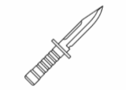

```bash
Es un comando moderno y especializado únicamente en el manejo de ramas.
Su función principal es: cambiar de rama, y crear ramas nuevas de forma más segura. Ayuda a evitar errores accidentales y simplifica el flujo de trabajo relacionado con ramas.
```

#### GITFLOW BÁSICO
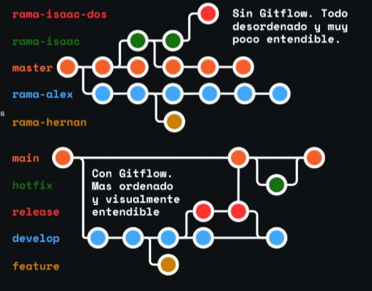

Un flujo de trabajo (workflow) en Git es un conjunto de reglas, prácticas y formas de organización que permiten trabajar de manera ordenada con las ramas de un proyecto. Este flujo define cómo se crean, utilizan y combinan las ramas, facilitando la gestión de versiones, el desarrollo de nuevas funcionalidades y la corrección de errores sin afectar el trabajo principal.

Además, un workflow ayuda a que cualquier persona pueda adaptarse fácilmente al proyecto y colaborar de forma organizada, manteniendo una estructura clara dentro del repositorio. El uso de flujos de trabajo es especialmente útil en proyectos colaborativos, ya que mejora el control del código, la coordinación entre integrantes y la administración de los cambios realizados en el proyecto.

#### ¿CÓMO FUNCIONA GITFLOW?

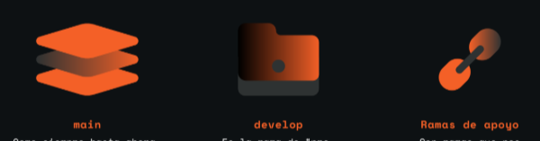

main: 
```bash
Como siempre hasta ahora, tenemos nuestra rama main (o máster) la cual es la que tenemos por defecto al crear un repositorio de git, el propósito de esta rama es contener el código que se encuentra en producción.
```
developer:
```bash
Es la rama de “pre-producción”. Su propósito es tener las características que se están probando más todavía no han sido probadas y/o validadas del todo, pero que serán lanzadas a producción pronto. Es donde más trabajarán a lo largo de su proyecto.
```
Ramas de apoyo:
```bash
Son ramas que nos permitiran escribir nuestro codigo y estas pueden ser feature release y hotfix
```

#### RAMA DE APOYO

Rama feature:
```bash
Las ramas feature se utilizan cuando se trabaja en una nueva funcionalidad o característica para el proyecto.
Estas ramas se crean a partir de la rama develop, permitiendo desarrollar cambios de manera aislada sin afectar el código principal. Una vez finalizada la funcionalidad, la rama se fusiona nuevamente con develop y posteriormente puede eliminarse.
Su objetivo principal es mantener organizado el desarrollo de nuevas características dentro del proyecto.
```

Rama release:
```bash
Las ramas release se utilizan para preparar el lanzamiento de una nueva versión del proyecto.
En esta etapa normalmente se realizan pruebas, correcciones menores y procesos de control de calidad (QA). Estas ramas nacen desde develop y, una vez que la versión está lista, los cambios se fusionan hacia main y también hacia develop.
Permiten estabilizar la versión antes de publicarla oficialmente.
```
Rama hotfix:
```bash
Las ramas hotfix se utilizan para solucionar problemas urgentes o errores encontrados en producción.
Estas ramas deben crearse directamente desde main, ya que esta representa la versión estable del proyecto. No se crean desde develop porque dicha rama puede contener cambios aún inestables o en desarrollo.
Una vez corregido el problema, la rama hotfix se fusiona nuevamente tanto en main como en develop, asegurando que la solución esté presente en ambas ramas.
```

RESUMIDO SERIA ...
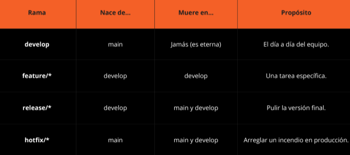

## Clase 6

### Flujo de trabajo y sincronización de ramas en Git

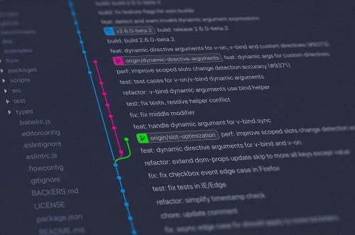

#### git merge 

El comando git merge se utiliza para fusionar ramas. su objetivo es integrar los cambios realizados en una rama dentro de otra, esto permite que todos los commints formen parte de un  mismo historial de trabajo

si una persona desarrolla una funcionalidad en una rama secundaria posteriormente puede unir esos cambios a la rama principal git 

También se suele usar el flag --no-ff (no fast forward). Este evita que Git haga una fusión rápida que elimine evidencia visual de la existencia de la rama. En cambio, obliga a crear un commit de merge, conservando el historial completo del desarrollo y facilitando el seguimiento de cambios incluso si la rama original es eliminada.


<span style="color:orange">git merge --no-off rama</span>

#### git fetch

El commando git fetch sirve para consultar y descargar información nueva del repositorio remoto sin modificar directamente los archivos locales del proyecto.

Permite verificar si existen nuevos commits o cambios realizados por otros colaboradores en las ramas remotas. Es útil para mantenerse informado antes de actualizar el repositorio local

<span style="color:orange">git fetch</span>


#### git pull

El comando git pull se utiliza para traer y actualizar automáticamente los cambios desde el repositorio remoto hacia la rama local actual

Internamente, combina git fetch y git merge, ya que primero descarga los cambios y luego los fusiona con la rama local

debes de epecificar el repositorio remoto (origin) y la rama para evitar errores

<span style="color:orange">git pull origin develop</span>

#### git push

El comando git push permite subir los commits locales al repositorio remoto para compartir los cambios con otros integrantes del proyecto.

También es recomendable especificar el repositorio remoto y la rama correspondiente.

<span style="color:orange">git push origin rama</span>

Cuando se sube una rama por primera vez, se utiliza el flag -u para vincular la rama local con la rama remota y evitar configuraciones posteriores 

<span style="color:orange">git push -u origin rama</span>

#### Flujo de trabajo sin Pull Request 

1 Cambiar a la rama principal: <span style="color:orange">git checkout develop</span>

2 Verificar cambios remotos: <span style="color:orange">git fetch</span>

3 Actualizar la rama local: <span style="color:orange">git pull origin develop</span>

4 Fusionar la rama de trabajo: <span style="color:orange">git merge --no-off rama</span>

5 Resuelves manualmente los archivos fallidos y sus conflictos, si existen archivos incompatibles

6 Agregar los archivos corregidos: <span style="color:orange">git add .</span>

7 Crear el commit del merge: <span style="color:orange">git commit</span>

8 Eliminar la rama ya utilizada: <span style="color:orange">git branch -D rama</span>

9 Subir los cambios finales al repositorio remoto: <span style="color:orange">git push origin develop</span>

#### Conflictos de Git

Un conflicto ocurre cuando dos personas modifican la misma parte de un archivo y Git no puede decidir automáticamente qué cambio conservar.

Esto suele suceder durante un git merge o git pull. En esos casos, Git marca los archivos con conflicto para que el usuario los revise manualmente.

Después de corregir los conflictos, se debe ejecutar: <span style="color :orange">git commmit</span>

para finalizar la fusion


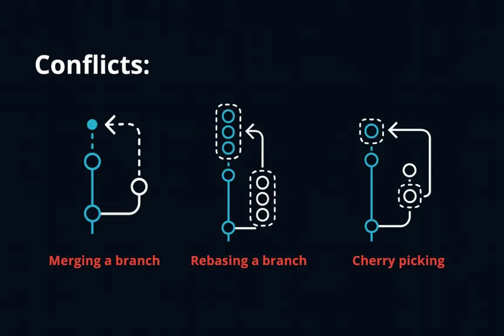

#### Ramas 

Una rama (branch) es una línea de desarrollo independiente dentro del proyecto. Permite trabajar en nuevas funcionalidades o correcciones sin afectar directamente la rama principal.

main o master: <span style="color:#2EE6C6">rama principal</span>

develop: <span style="color:#2EE6C6">rama de desarrollo</span>

ramas secundarias: <sapn style="color:#2EE6C6">usadas para nuevas funciones o pruebas</span>


```Crear ramas ayuda a mantener el proyecto organizado y facilita el trabajo en equipo```

Crea una nueva rama, pero no cambia automáticamente hacia ella: <span style="color:#2EE6C6">git brach nueva-rama</span>

Sirve para cambiarse a otra rama existente: <span style="color:#2EE6C6">git checkout nueva-rama</span>

Crea la rama y cambia a ella: <span style="color:#2EE6C6">git checkout -b nueva-rama</span>

Sirve para ver todas las ramas <sapn style="color:#2EE6C6">git branch</span>