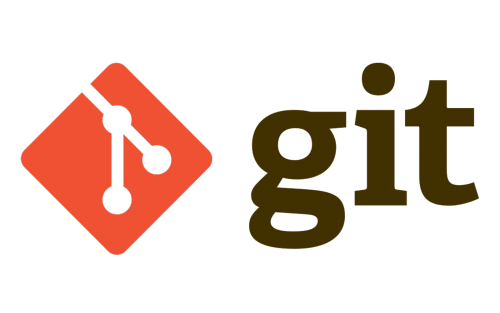
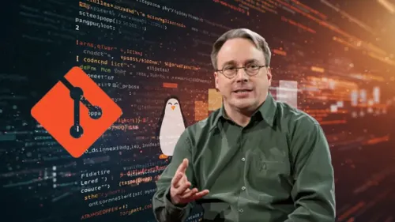
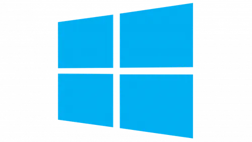
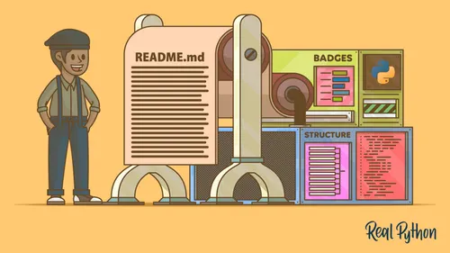
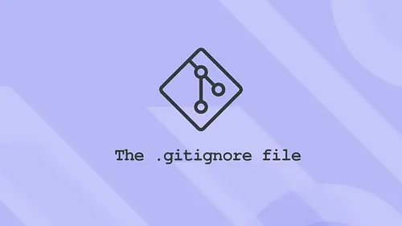
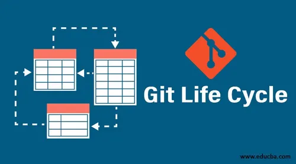

# Trabajo Individual

Ronal Jancoña Paicho 

GitHub: RonalSinD

## Clase 1 

### ¿Qué es GIT?
Es un Sistema de Control de  Versiones Distribuido (VCS) open source, creado poor Linus Torvalds en 2005.
nos permite guardar archivos y las versiones de estos a lo largo del tiempo de manera local, guarda el historial de cambios de un proyecto, podemos volver atras si algo falla, trabajo en equipo sin perjudicar a ningun integrante ya que cada uno tiene una copia completa del repositorio, mantener diferentes verciones de un mismo proyecto `ramas`.



### ¿Cómo nació GIT?
La creacion de GIT sucedio por varias razones de un mismo problema, porque en ese entonces BITKEEPER dejo de ser gratuito y Linus Torvalds no queria pagar por una licencia por que linux es open source, asi que decidio crear su propio sistema de control de versiones al que llamo GIT, motivado tambien por que estaba cansado de depender de heramientas propietarias que no podia controlar, termino creando una de las herramientas mas importantes para los desarrolladores en todo el mundo.

Creo GIT en 2 a 3 semanas despues...




### ¿Cómo instalar GIT?
Para instalar GIT debe de ir a su pagina web [Instalar GitHub](https://git-scm.com/downloads) y seguir los pasos de instalacion de tu Sistema Operativo, Git esta disponible tanto para:

Linux:    [descarga](https://git-scm.com/install/linux)


macOS:    [descarga](https://git-scm.com/install/mac)


Windows:  [descarga](https://git-scm.com/install/windows).



GIT es multiplataforma, funciona de igual madera en deferentes Sistemas Operativos, lo unoco que cambia es la forma de instalarlo: como tengo Debian lo explicare, en la distro de Debian se deben de ejecutar los comandos:```sudo apt update``` y ```sudo apt install git``` asi de facil, una vez instalado GIT verifica con el comando ```git --version```


### Configuraciones Básicas
Antes de comenzar a usar Git, es recomendable configurar tu nombre de usuario y correo electrónico:
```bash
git config --global user.name "Tu Nombre"
git config --global user.email "tu_correo@gmail.com"
git config --global core.autocrlf true
```
este ultimo es importante porque sirve para manejar automaticamente los saltos de  linea entre distintos Sistemas Operativos, resuelve el problema de:

Windows usa: CRLF(Carriage Return + Line Feed)

Linux/macOS usan: LF (Line Feed)


### Archivos que todo repositorio debería tener
README.md es un archivo  de documentacion en formato Markdown(.md) esto describe tu proyecto, sirve para expllicar que hace tu proyecto, indica como instalarlo o usarlo, muestra ejemplos, documentar dependencias, comandos, estructura, da un contexto a cualquier persona que vea el repositorio.


#### README.md
Es importante porque es lo primero que se ve en la plataforma de GITHUB, permite que otros entiendad tu proyecto sin leer codigo, mejora la presentacion y profecionalismo del repositorio.




#### .gitignore
.gitignore es un archivo que le dice a Git qué archivos o carpetas NO debe rastrear (trackear), sirve para evitar subir cosas innecesarias o sencibles como archivos temporales(`.log`,`.tmp`), dependencias(`node_modules/`), archivos del sistema(.`DS_Store`,`Thumbs.db`), configuraciones locales, claves o contraseñas.



tanto README.md y .gitignore se usan siempre juntos, porque cumple funciones complementarias 

README.md `Explica el proyecto`

.gitignore `Mantener limpio el repositorio`


## Clase 2

### STATES Y COMMITS
Un resumen breve de estos dos conceptos seria que states(estados en Git), son las etapas por las que pasa un archivo de un Git, `Directorio de Trabajo`: La carpeta local, donde estamos trabajando, pero Git aun no lo tiene registrado, `Stage Area`: El area de espera donde todo esta lsito para guardarse, `Repositorio local`: archivo guardado en el historial del repositorio.

Commit(buenas practicas) seria un modo convencional para escribir mensajes de commit claros, estructurados y consistentes, de modo que el historial del proyecto sea facil de entender y automatizar.




```Bash
Directorio de Trabajo: 
  ⮟
  Creo,modifico o elimino los ficheros
  ⮟
  Preparo los cambios que quiero grabar
  ⮟
Area Temporal Transitoria(Stage Area)
  ⮟
  Confirmo los cambios y los grabo en el repositorio
  ⮟
Repositorio Local
  ⮟
  Sincronizo los cambios con el repositorio en el servidor
  ⮟
Repositorio Remoto
```
### DIRECTORIO DE TRABAJO (MODIFICADO)
Es smplemente una carpeta comun, con la unica diferencia que Git observa tus archivos, y los cataloga en:

`Untracked`: Archivo nuevo de Git o esta en seguimiento

`Modified`: Archivo que ya existe en Git, pero fue modificado

cuando un archivo no esta en el `.gitignore` pasa automaticamente a uno de estos estados

#### git restore archivo
Borra fisicamente lo que escribieron haciendo que tu archivo vuelva asu estado de ultimo commit, asi que mucho cuidado con este comando.

#### touch .gitignore
Crea una carpeta destinada para archivos, cuando tienes este archivo no se sube al repositorio, no existira para otros, no se vera todo lo que este en el .gitigore, no se vera nada de lo que contenga en el gitignore en platafirmas como GIT HUB.

### STAGE AREA (PREPARADO)
Nos permite seleccionar archivos modificados que es incluiran en el siguiente commit(guardado) y cuales no.
para traer archivos a este estado se debe hacer 
 
 ```Bash
 git add archivo : "agrega el archivo name_archivo, lo hace uno por uno"
 git add . : "agrega todos los archivos que esten obserbados por Git"
 git restore --staged archivo : "para sacar un archivo estado stage area para 
 ```

### REPOSITORIO LOCAL (CONFIRMADO)
Es la ultima fase donde le decimos al repositorio que cree el punto de guardado para que todos los cambios que estan en staged pasen a ser parte del historial.
```bash
 git commit -m "mensaje"
 git reset --soft HEAD~1 : si quieres deshacer el ultimmo commit
```


### BUENAS PRACTICAS
#### ¿Cada cuanto debo hacer un commit?
Los commits atómicos son una práctica en Git donde cada commit representa un único cambio pequeño, unico y completo. Es lo contrario a hacer un solo commit grande con muchos cambios, se divide el trabajo en partes pequeñas

Cada commit resuelve una sola cosa, ser entendible por si mismo, mantener el proyecto en estado funcional

### Escribe buenos commits
Un commit debe de describir lo  que hace en pocas palabras y de manera simple pero efectiva:
#### 1. USA VERBOS IMPERATIVOS

Add: Significa que se agrega un nuevo archivo

Change: Significa que se modifica un archivo existente

Fix: Significa que se arregla un bug

Remove: Significa que seelimina un archivo existente

#### 2. NO USES PUNTO FINAL NI PUNTOS SUSPENSIVOS EN TUS MENSAJES
Usar puntuación mas alla de una coma es innecesario a la hora de hacer un buen commit
```bash
git commit -m “Add new search feature.”  MAL. No uses punto final

git commit -m “Fix a problem with topbar..” MAL. No uses puntos suspensivos

git commit -m “Change the default system color” BIEN
```

#### 3. USA COMO MAXIMO 50 CARACTERES
Se corto y conciso con tus commits, evitando explicar mucho en un solo commit, siiendo una buena practica separarlo en diferentes commits 


#### 4. USA PREFIJOS PARA TUS COMMITS PARA HACERLO MAS SEMANTICO 
Para que el historial sea legible y se sepa mas facilmente lo que se hace se usa este tipo de commits:

 ```git commit -m "tipo de commit:descripcion" ```


 ```git commit -m "feat: add search feature" ```

```Prefijos```:

```feat: para una nueva característica para el usuario.```

```fix: para un bug que afecta al usuario.```

```perf: para cambios que mejoran el rendimiento del sitio.```

```build: para cambios en el sistema de build, tareas de despliegue o instalación.```

```ci: para cambios en la integración continua.```

```docs: para cambios en la documentación.```

```refactor: para refactorización del código como cambios de nombre de variables o funciones.```

```style: para cambios de formato, tabulaciones, espacios o puntos y coma, etc; no afectan al usuario```

```test: para tests o refactorización de uno ya existente.```


#### 5. AÑADE TODO EL CONTEXTO QUE SEA NECESARIO EN EL CUERPO DEL COMMIT
A veces un commit no se puede explicar bien con una sola frase. En esos casos, en vez de hacer el título muy largo o confuso, se añade información extra en el cuerpo del mensaje del commit.

Con git commit, la primera línea se usa como título corto y claro, y a partir de la segunda línea se escribe la explicación detallada. En esta parte sí se pueden usar reglas normales de escritura, como puntos y comas, porque sirve para dar contexto más completo del cambio.

La idea es mantener el título simple, y usar el cuerpo solo cuando realmente haga falta explicar mejor qué se hizo o por qué se hizo.

git commit 

prefijo:Titulo de tu commit 

Cuerpo que describe tu commit
